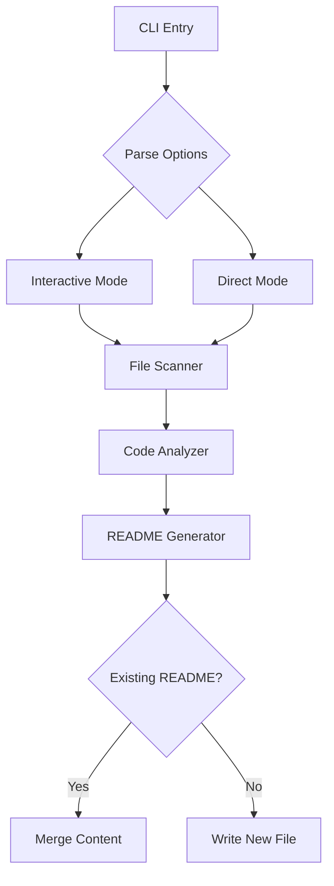

<div align="center">

# 🚀 gen-readme

[](https://www.npmjs.com/package/@okenneth1964/gen-readme)
[](LICENSE)
[](https://nodejs.org)
[](CONTRIBUTING.md)

> AI-powered README generator

<p align="center">
  
</p>

[Key Features](#-key-features) •
[Installation](#-installation) •
[Usage](#-usage) •
[Documentation](#-documentation) •
[Contributing](#-contributing)

</div>

## ✨ Key Features

- 🤖 **AI-Powered Analysis** - Leverages Google's Gemini model for intelligent code analysis
- 📝 **Smart Generation** - Creates comprehensive README files with all essential sections
- 🔍 **Code Structure Detection** - Automatically detects and documents project structure
- 📊 **Dependency Analysis** - Parses and categorizes project dependencies
- 📈 **Mermaid Diagrams** - Generates architecture and flow diagrams automatically
- 🎨 **Beautiful CLI** - Interactive command-line interface with colorful output
- 🔄 **Merge Support** - Smart merging with existing README files
- ⚡ **Fast & Efficient** - Optimized file scanning and processing

## 🚀 Quick Start

### Prerequisites

- Node.js >= 16
- npm or yarn
- Google Gemini API key

### 📥 Installation

```bash
npm install -g gen-readme
```

### Usage

```bash
gen-readme [path]
```

**Example:**

```bash
gen-readme ./my-project
```

or

```bash
gen-readme # This will scan the current directory
```

### Interactive Mode

```bash
gen-readme -i
```

### Advanced Options

| Option | Description |
|--------|-------------|
| `-c, --codebase` | Specify codebase path |
| `-f, --force` | Force overwrite existing README |
| `-m, --merge` | Merge with existing README |
| `-i, --interactive` | Interactive mode |

## 📖 Documentation

### CLI Architecture



### Features

- AI-powered code analysis
- Automatic generation of detailed README.md files
- Support for code structure detection and dependency parsing
- Integration with Mermaid for diagram generation
- Customizable templates


### Dependencies

**Runtime:**

- [@google/generative-ai](https://www.npmjs.com/package/@google/generative-ai)
- [commander](https://www.npmjs.com/package/commander)
- [dotenv](https://www.npmjs.com/package/dotenv)
- [fast-glob](https://www.npmjs.com/package/fast-glob)
- [ora](https://www.npmjs.com/package/ora)
- [chalk](https://www.npmjs.com/package/chalk)
- [mermaid](https://www.npmjs.com/package/mermaid)
- [badge-maker](https://www.npmjs.com/package/badge-maker)

### Contributing
-Fork the repo
-Create a new branch
-Make your changes
-Commit your changes
-Push your changes
-Create a pull request

Contributions are welcome! Please read the [contributing guidelines](https://github.com/your-org/gen-readme/blob/main/CONTRIBUTING.md) before submitting a pull request.

**Development:**

- [esbuild](https://www.npmjs.com/package/esbuild)
- [jest](https://www.npmjs.com/package/jest)

### License

MIT
This project is licensed under the MIT License - see the [LICENSE](LICENSE) file for details.

## 🙏 Acknowledgments
- Google Gemini for AI capabilities
- Osei Ansah
- Expo Ghana Community
- Samuel Agbenyo
- All our [contributors](https://github.com/your-org/gen-readme/graphs/contributors)

<div align="center">

Made with ❤️ by [@Okenneth1964](https://github.com/Okenneth1964)

</div>